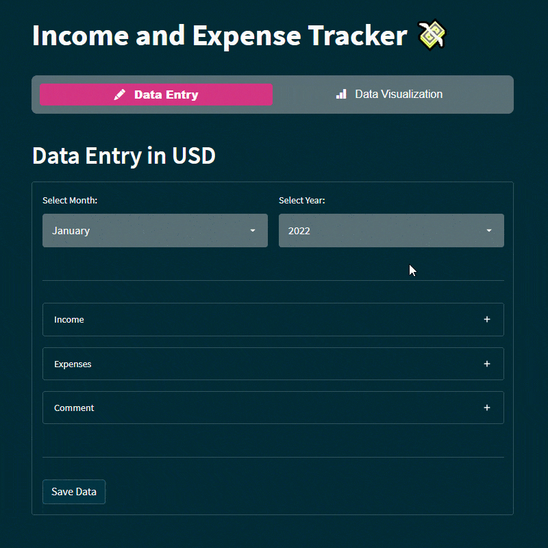

# Streamlit app using NoSQL Database to track Income and Expenses.

Keep track of your monthly income and expenses without the need for Excel!

In this platform I will lever the power of Python using the streamlit library to build an interactive web application. 

Store your monthly reports using the FREE NoSQL Database from deta (https://deta.sh). 

To visualize the monthly spending, a Sankey Chart from Plotly will be implemented.

Deployed Dashboard: https://richiegarafola-expensesheet.streamlitapp.com/
 
---

**Libraries Used:** Streamlit for the open-source app framework, Plotly Graph Objects for interactive data visualization, Calendar for the calendar and datetime for basic date and time. 

Local functions were stored in the database.py file and imported into the app as well. 
**Local Functions:** [Database](database.py)

---

**For this assignment, there are three main tasks:**

1. [Build a Custom App](#Build-a-Custom-Web-App)

2. [Connect streamlit to Database](#Connect-to-Database)

3. [Interactive Sankey Chart](#Create-Interactive-Sankey-Chart)

---

## Instructions

**File:** [App](app.py)

### Build a Custom Web App

**View the Streamlit application**
Run the Streamlit application to view a completed web app. To do so, complete the following steps:

1. In the terminal, navigate to the projects folder.
2. In the terminal, run the Streamlit application by using streamlit run "app.py"

### Connect to Database

First, an API key is required to be added to a local enviornment file in order to establish connection. 

Once the API key is saved in the env file, it is essential to initialize the  enviornment. This can be done by inserting the secret key into the Deta() object.

In order to establish the connection to the database we will use the deta object and call the Base() module to name the database.

Next we will create a couple of functions:
    - One will be used to insert the values of a single instance into the database
    - Fetch all periods to fill the selection box
    - Get all values from a particular period to plot the data

### Create Interactive Sankey Chart

A Sankey diagram is a flow diagram, in which the width of arrows is proportional to the flow quantity.

Sankey diagrams visualize the contributions to a flow by defining source to represent the source node, target for the target node, value to set the flow volume, and label that shows the node name.

---

## Resources

* [Deta](https://www.deta.sh/)

* [gitignore](https://www.toptal.com/developers/gitignore/api/python)

* [Plotly - Sankey](https://plotly.com/python/sankey-diagram/)

